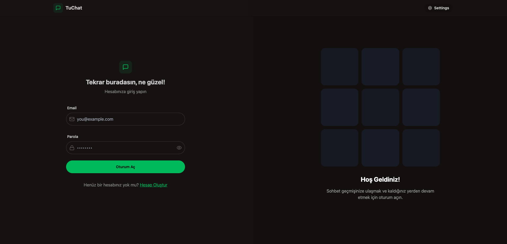
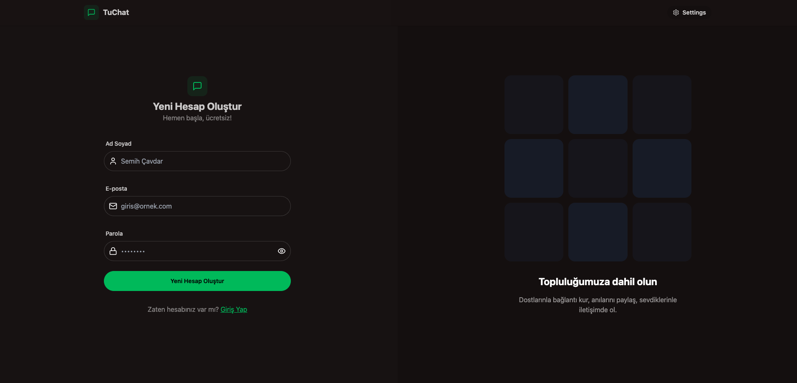
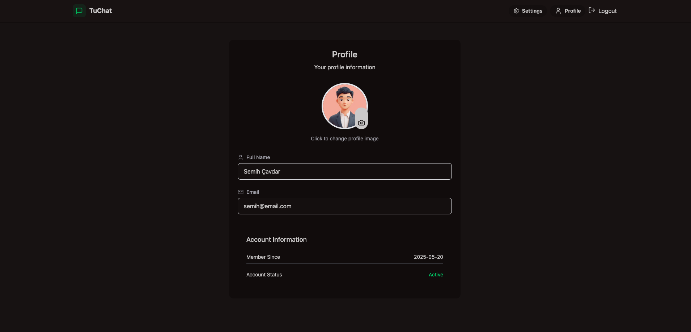
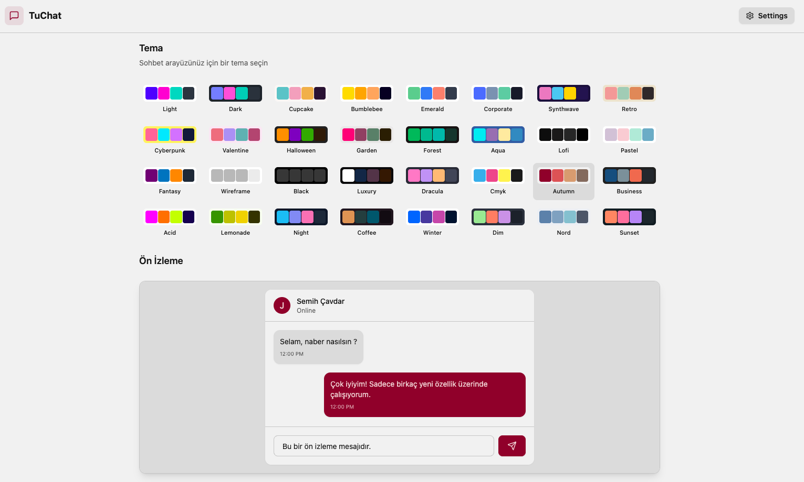
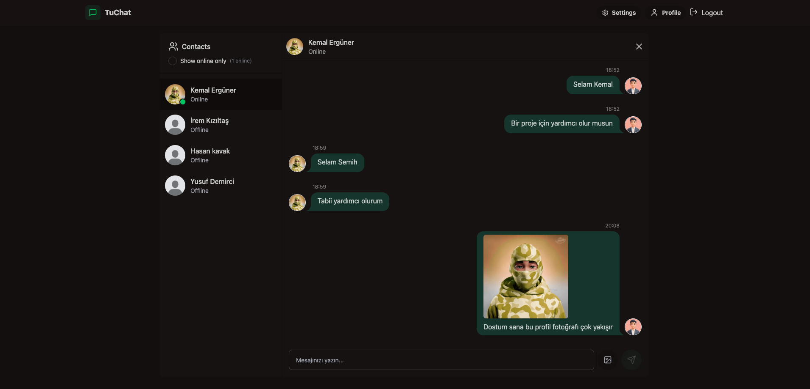

# TuChat 💬

**TuChat** is a full-stack real-time chat application built with modern web technologies. Users can register, log in securely, and chat in a clean, responsive interface that supports light and dark themes.

🌐 **Live Demo**: [TuChat Demo](https://tuchat-fullstack-app.onrender.com)

---

## 🚀 Features

- 🔐 Secure authentication with JWT
- 💬 Real-time messaging between users
- 🎨 Light/Dark theme support (via DaisyUI)
- 📱 Fully responsive and mobile-friendly UI
- ⚙️ Global state management with Zustand
- 🧠 Intuitive and minimal user experience
- 📦 RESTful API architecture

---

## 🖼️ Screenshots

| Login                           | Signup                          | Profile                         | Settings                        | Chat                            |
| -------------------------------| -------------------------------| -------------------------------| -------------------------------| -------------------------------|
|        |      |    |  |          |

*Screenshots showcase the clean and intuitive interface of TuChat.*

---

## 🛠️ Tech Stack

### Frontend

- **React.js** (with Vite)
- **Tailwind CSS** + **DaisyUI**
- **Zustand** – state management
- **Axios** – HTTP client
- **Lucide-react** – icons library

### Backend

- **Node.js** + **Express**
- **MongoDB** + **Mongoose**
- **Bcrypt.js** – password hashing
- **JSON Web Tokens (JWT)** – user authentication

---

## 📁 Project Structure

```bash
TuChat/
├── client/               # Frontend (React)
│   ├── components/       # Shared UI components
│   ├── pages/            # Main pages: Login, Register, Home, Profile, Settings
│   ├── store/            # Zustand state stores
│   └── main.jsx          # React entry point
├── server/               # Backend (Express)
│   ├── controllers/      # Request handlers
│   ├── models/           # Mongoose schemas
│   ├── routes/           # API endpoints
│   └── index.js          # Server entry point


